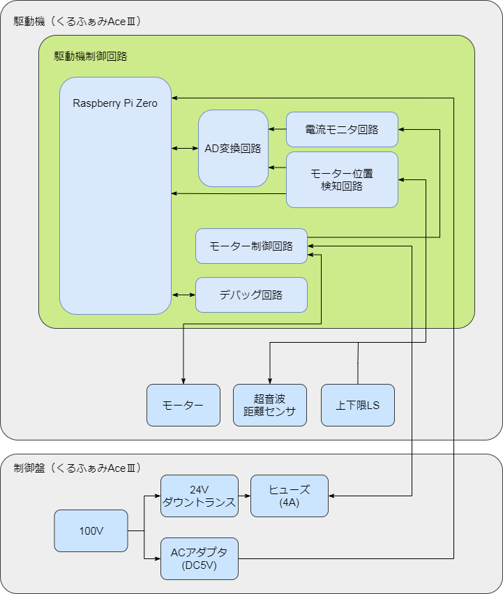

# ハードウェア仕様

## 変更履歴
| ver | 変更日時 | 変更者 | 変更内容 |
|:----|:--------:|:------:|:---------|
| 0.1 | 2021/07/11 | 菊地 | 新規作成 |

## 目次

- [駆動機制御装置](#駆動機制御回路)
  - [目的](#目的)
  - [動作環境](#動作環境)
  - [ブロック図](#ブロック図)
  - [ハードウェア仕様](#ハードウェア制御仕様)
  - [ハードウェア制御仕様](#ハードウェア制御仕様)

## 駆動機制御装置
### 目的
この装置はビニールハウスの換気装置の自動化における、ビニールハウス横のビニールを巻き上げるためのモーターを制御する装置である

### 動作環境
 - 温度: -30.0[℃] ~ 50[℃]
 - 湿度: 0[%] ~ 100.0[%]

### ブロック図

### ハードウェア仕様
#### 電流モニタ回路
0[A]~4.5[A]までをモニタ可能なこと

#### モーター位置検知回路
駆動機と地上の距離を測定すること
駆動機の上下限を検出すること

#### モーター制御回路
下記スペックのモーターを制御すること
 - 電圧:24.0[V] 定格電流:2.0[A]
 - 許容最大電流:4.0[A]

#### AD変換回路
下記アナログ値をモニタし、Raspberry Pi Zeroに入力すること
 - 電流モニタ回路から出力される電流値
 - 電流モニタ回路のシャント抵抗温度