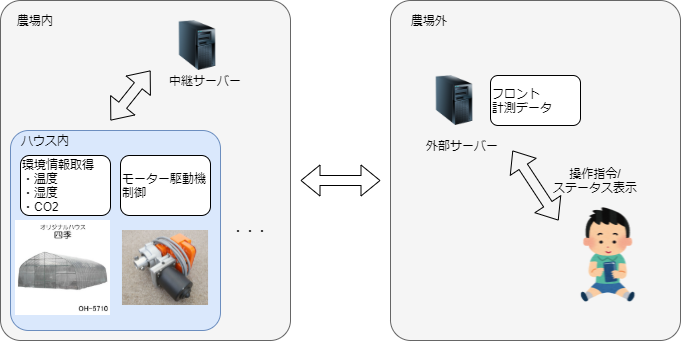
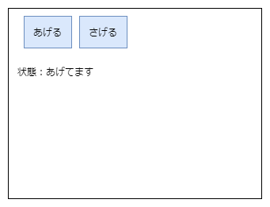

# ビニールハウス自動換気装置仕様

## 変更履歴
| ver | 変更日時 | 変更者 | 変更内容 |
|:----|:--------:|:------:|:---------|
| 0.1 | 2021/07/03 | 菊地 | 新規作成 |

## 目次
- [概要](#概要)
  - [目的](#目的)
  - [ブロック図](#ブロック図)
- [ハードウェア仕様](#中継サーバ→管理サーバ)
- [ハードウェア制御仕様](#管理サーバ→中継サーバ)
- [通信仕様](#通信仕様)
- [操作画面仕様](#操作画面仕様)
  - [認証画面](#認証画面)
  - [操作画面](#操作画面)

## 概要
### 目的
本装置は、トマト生産におけるビニールハウス換気を人を介さず行い、生産の効率化を目的とした装置である
### ブロック図
  
## ハードウェア

## 通信仕様
下記参照
- [管理サーバ-中継サーバ間_通信仕様書](https://github.com/Kyokko-OB-Team/Document/blob/master/specifications/%E7%AE%A1%E7%90%86%E3%82%B5%E3%83%BC%E3%83%90-%E4%B8%AD%E7%B6%99%E3%82%B5%E3%83%BC%E3%83%90%E9%96%93_%E9%80%9A%E4%BF%A1%E4%BB%95%E6%A7%98%E6%9B%B8.md)
- [自動巻き上げ機 通信仕様書](https://github.com/Kyokko-OB-Team/Document/blob/master/specifications/%E8%87%AA%E5%8B%95%E5%B7%BB%E3%81%8D%E4%B8%8A%E3%81%92%E6%A9%9F_%E9%80%9A%E4%BF%A1%E4%BB%95%E6%A7%98%E6%9B%B8.md)

## 操作画面仕様
下記操作を農場の内外かかわらず実行できること
 - ボタン
   - あげる: 駆動機に換気開始指令を送信する
   - さげる: 駆動機に換気終了指令を送信する
 - ラベル
   - 状態: 現在の駆動機指令状態・エラー等を表示する
### 認証画面
*TBD
### 操作画面

