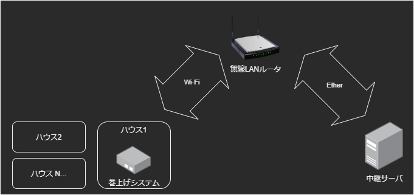

# 自動巻き上げ機  通信仕様書

## 変更履歴
| ver | 変更日時 | 変更者 | 変更内容 |
|:----|:--------:|:------:|:---------|
| 0.1 | 2021/04/18 | gari | 新規作成 |
| 0.2 | 2021/04/19 | gari | 状態通知コマンド(Req)のコマンド修正 |
| 0.3 | 2021/07/04 | M.Hashimoto | IPアドレス割付変更 伝文フォーマット修正 |

## 目次
- [用語](#用語)
- [基本仕様](#基本仕様)
- [IPアドレス割当](#IPアドレス割当)
- [電文フォーマット](#電文フォーマット)
- [コマンド一覧](#コマンド一覧)
  - [通信開始コマンド](#通信開始コマンド)
  - [状態通知コマンド](#状態通知コマンド)
  - [動作制御コマンド](#動作制御コマンド)
  - [機器No変更コマンド](#機器No変更コマンド)
- [コマンドのリトライについて](#コマンドのリトライについて)

## 用語

- 管理サーバ : 自動巻き上げ機の制御を管理するPC
- 中継サーバ : 管理サーバとクライアントの橋渡しをするPC
- クライアント : 実際にアクチュエータを制御する機器

## 基本仕様

本仕様書では、クライアントと中継サーバ間の通信仕様を記載する。

  

- 中継サーバ・クライアント間の通信はTCP/IPで通信を行う。  
- IPアドレスはIPv4を使用し、各機器は全て固定アドレスを持つ。
- 通信は全て1対1で通信を行い、ブロードキャストは使用しない。  
- 初回通信や定期通信はクライアントから送信する。
- 電文フォーマットの変更に対応するため、最後に通信した際の電文フォーマットバージョンを保存する。
- 電文が化けた場合やチェックサムが異なる場合は、受信した電文を破棄する。
- 各通信の応答は30s以内に行う。時間内の応答が不可能な場合はNAKを応答する。

## IPアドレス割当

以下にそれぞれの機器のIPアドレス割当を記載する。
なお、ネットワーククラスは `B` (ネットワークマスクが255.255.0.0)を使用する。

| 機器 | 第1-2オクテット | 第3オクテット | 第4オクテット |
|-----:|:---------------:|:-------------:|:--------------|
| 中継サーバ | 192.168 | 0 | 1 |
| クライアント | 192.168 | 0～254 | 2～254 |

## 電文フォーマット

中継サーバ・クライアント間の通信電文は以下のフォーマットで構成される。 

| STX  | 送信元ID | 送信先ID | 伝文番号 | 機器No | コマンドID | データサイズ | データ部 | ETX  | チェックサム |
| ---- | -------- | -------- | -------- | ------ | ---------- | ------------ | -------- | ---- | ------------ |

| 項目 | Size(Byte) | 説明 |
|-----:|:------------:|:-----|
| `STX` | 1 | 制御コード(0x02) |
| `送信元ID` | 2 | 送信元のIPアドレス(第3、第4オクテット) |
| `送信先ID` | 2 | 送信先のIPアドレス(第3、第4オクテット) |
| `電文番号` | 2 | 電文毎に加算していき、0xFFFF→0x0000となる ResponseはRequestと同じ電文番号で行う |
| `機器No` | 2 | クライアント固有の番号で、ユーザが設定を行う 未設定の場合は0を設定する |
| `コマンド` | 1 | コマンドID |
| `データサイズ` | 1 | データ部のサイズ |
| `データ部` | 可変長 | コマンドに応じたデータ |
| `ETX` | 1 | 制御コード(0x03) |
| `チェックサム` | 1 | CRC16-CCITT(STXからETXまで) |

## コマンド一覧

以下に中継サーバ・クライアント間で使用可能なコマンドを記載する。

| コマンド | コマンド名 | 説明 |
|---------:|:----------:|:-----|
| `0x01` | 通信開始コマンド | 中継サーバとの接続確認を行う |
| `0x02` | 状態通知コマンド | 中継サーバへクライアントの状態通知を行う |
| `0x10` | 動作制御コマンド | 中継サーバからクライアントへの制御要求を行う |
| `0x11` | 機器No変更コマンド | 中継サーバからクライアントへ機器ナンバーの変更を行う |

### 通信開始コマンド

クライアントの起動時に中継サーバとの通信確認のために行う。 
クライアントは起動時、または30分以上中継サーバと通信が行えなかった場合に本コマンドを送信し 
中継サーバとの通信を開始する。 
コマンドID:0x01

■クライアント→中継サーバへの電文(Request) 

| コマンド名 | Size(Byte) | 説明 |
|-----------:|:----------:|:-----|
| `クライアント種別ID` | 1 | [クライアントIDリスト](#クライアントIDリスト)を参照 |

■中継サーバ→クライアントへの電文(Response) 

| コマンド名 | Size(Byte) | 説明 |
|-----------:|:----------:|:-----|
| `処理結果` | 1 | ACK:電文を正常に処理できた場合に応答する NAK:電文の処理が失敗した場合に応答する |
| `電文フォーマットバージョン` | 1 | 電文のバージョン番号 |

#### クライアントIDリスト
| クライアントIDリスト | クライアント種別名 |
|---------------------:|:-------------------|
| 0x01 | 自動巻き上げ機 |

----

### 状態通知コマンド

クライアントの状態通知と死活監視のために行う。 
クライアントは本コマンドを30s間隔で中継サーバに対して送信する。 
コマンドID:0x02

■クライアント→中継サーバへの電文(Request) 

| コマンド名 | Size(Byte) | 説明 |
|-----------:|:----------:|:-----|
| `モータ動作状態` | 1 | 0x00:空転 0x0A:上昇 0x0F:下降 0xFF:ブレーキ |
| `上下限スイッチ状態` | 1 | 0x00:上下スイッチOFF 0x0A:上スイッチON 0x0F:下スイッチON |
| `開き具合段階` | 1 | 開き具合の段階情報(TDB) |
| `異常状態` | 2 | [異常状態一覧](#異常状態一覧)を参照 |

■中継サーバ→クライアントへの電文(Response)  

| コマンド名 | Size(Byte) | 説明 |
|-----------:|:----------:|:-----|
| `処理結果` | 1 | ACK:電文を正常に処理できた場合に応答する NAK:電文の処理が失敗した場合に応答する |

#### 異常状態一覧

| 異常ID | 説明 | 原因 |
|-------:|:-----|:-----|
| 0x0000 | 異常なし | |
| 0x0001 | 温度異常 | 基板が高温(TDB:具体的な温度の確認)
| 0x0002 | 距離センサ異常 | 距離センサの故障 |
| 0x0004 | 電流異常 | 漏電 |
| 0x0008 | モータロック | モータ回転しているのに動かない |
| 0x0010～0x8000 | 予備 | |

----

### 動作制御コマンド

中継サーバからクライアントへの動作要求を行う。 
コマンドID:0x10

■中継サーバ→クライアントへの電文(Request) 

| コマンド名 | Size(Byte) | 説明 |
|-----------:|:----------:|:-----|
| `モータ動作要求` | 1 | 0x0A:全開 0x05:全閉 |
| `動作制御` | 1 | 予備 |

■クライアント→中継サーバへの電文(Response)  

| コマンド名 | Size(Byte) | 説明 |
|-----------:|:----------:|:-----|
| `処理結果` | 1 | ACK:電文を正常に処理できた場合に応答する NAK:電文の処理が失敗した場合に応答する |

----

### 機器No変更コマンド

中継サーバで各クライアントを識別するための機器Noの変更を行う。 
クライアントは、変更前の機器Noで本コマンドを送信すること。 
ACKを受信した場合は、変更後の機器Noで、通信開始コマンドから通信を始めること。 
機器Noは1～65535までを設定可能な値とし、0は設定不可とする。(未設定を表すため) 
コマンドID:0x11

■中継サーバ→クライアントへの電文(Request)

| コマンド名 | Size(Byte) | 説明 |
|-----------:|:----------:|:-----|
| `機器No` | 2 | 変更後の機器No(1～65535) |

■クライアント→中継サーバへの電文(Response)

| コマンド名 | Size(Byte) | 説明 |
|-----------:|:----------:|:-----|
| `処理結果` | 1 | ACK:機器Noの変更が正常に処理できた場合に応答する NAK:機器Noの変更が正常に処理できなかった場合に応答する |

## コマンドのリトライについて

■中継サーバ→クライアント

コマンドの応答がNAKの場合や、応答がなかった場合はリトライを行う。 
リトライが発生した場合は、10s後に失敗した通信を再送信する。 
クライアントとの通信が3分以上行えなかった場合は、通信不可と判断しリトライ中の電文を破棄する。 

■クライアント→中継サーバ

コマンドの応答がNAKの場合や、応答が無かった場合はリトライを行う。 
リトライが発生した場合は10s～30s間ランダムで待機後、失敗した通信を再送信する。 
中継サーバとの通信が30分以上行えなかった場合は、通信不可と判断しリトライ中の電文を破棄する。 
その後、2分間隔で[通信開始コマンド](#通信開始コマンド)を送信し、中継サーバとの通信復旧を待機する。 
