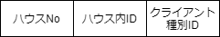

# 自動巻き上げ機  通信仕様書

## 変更履歴
| ver | 変更日時 | 変更者 | 変更内容 |
|:----|:--------:|:------:|---------:|
| 0.1 | 2021/02/31 | gari | 新規作成 |

---

## 目次
- [用語](#用語)
- [仕様](#仕様)
  - [基本仕様](#基本仕様)
  - [IPアドレス割当](#IPアドレス割当)
  - [電文フォーマット](#電文フォーマット)

---

## 用語

- サーバ : 自動巻き上げ機の制御を管理するPC
- クライアント : 自動巻き上げ機のラズパイ

---

## 仕様

本仕様書では、クライアントとサーバ間の通信仕様を記載する。

  

### 基本仕様

- サーバ・クライアント間の通信はTCP/IPで通信を行う。  
- IPアドレスはIPv4を使用し、各機器は全て固定アドレスを持つ。
- 通信は全て1対1で通信を行い、ブロードキャストは使用しない。  
- 通信はクライアントから送信する。
- 電文フォーマットの変更に対応するため、最後に通信した際の電文フォーマットバージョンを保存する。

### IPアドレス割当

以下にそれぞれの機器のIPアドレス割当を記載する。 

| 機器 | 第1-2オクテット | 第3オクテット | 第4オクテット |
|-----:|:---------------:|:-------------:|:--------------|
| サーバ | 192.168 | 0 | 1 |
| クライアント | 192.168 | ハウスNo(1～) | ハウス内ID(1～) |

クライアント機は、ハウス毎に第3オクテットを分け、
ハウス内の機器毎に順番に割り当てを行う。

### 電文フォーマット

#### 初回通信

クライアントの起動時にサーバとの通信確認のために行う。

| コマンド名 | 説明 |
|-----------:|:-----|
| `ハウスNo` | ハウス毎に割り当てられる番号 |
| `ハウス内ID` | ハウス内の機器にそれぞれ割り当てるID |
| `クライアント種別ID` | 自動巻き上げ機：0x01  

